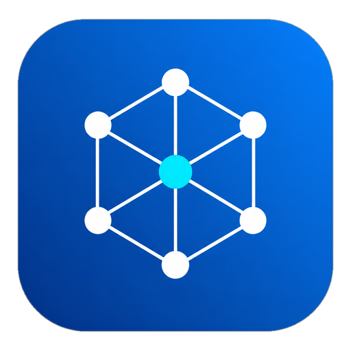
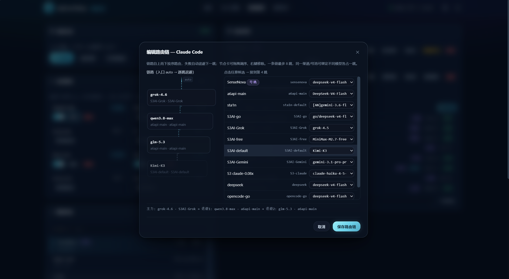
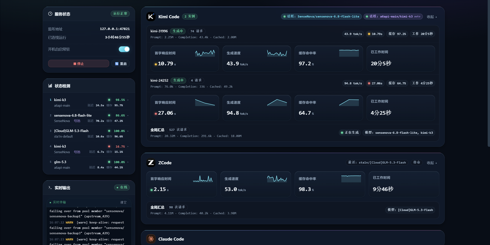
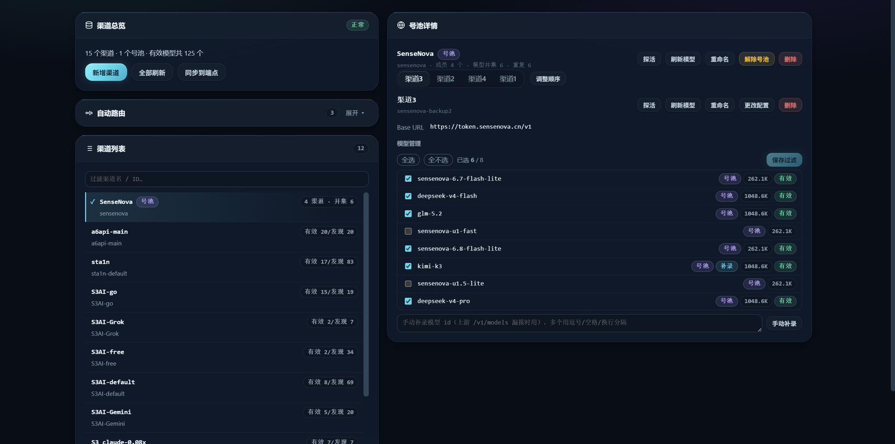
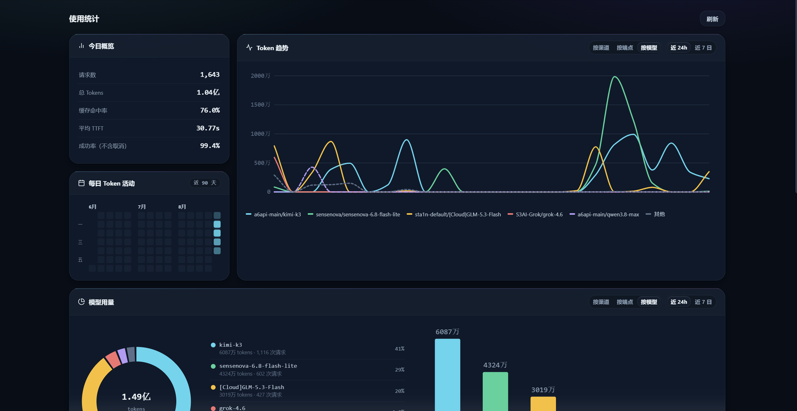
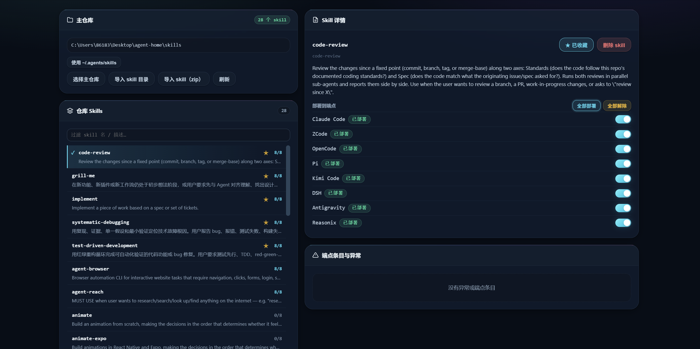

<p align="center">
  
</p>

# Anyswitch

<p align="center">
  <a href="#english"><b>English</b></a> · <a href="#中文"><b>中文</b></a>
</p>

A local AI credential relay for Windows: it funnels multiple OpenAI-compatible upstreams into a single loopback relay on 127.0.0.1, served through two protocol frontends — OpenAI-native and Anthropic Messages (via translation). Upstream API keys are sealed with Windows DPAPI and never leave your machine.Suitable for developers who mainly use the aggregate hub model or use multiple harness tools at the same time.

---

## English

### Features

- **Credentials stay on your machine** — upstream API keys are sealed per-provider with Windows DPAPI (entropy `ApiCred|DPAPI|v2|<ProviderId>`), decrypted only in memory at request time, never cached, never written to disk in plaintext.
- **Single source of truth** — one v2 `store.json` describes all providers, models, and routing metadata; it contains no secrets, only a controlled `credentialFile` reference.
- **Two protocol frontends, one relay** — the loopback relay on `127.0.0.1:47821` serves OpenAI-compatible requests natively (`/openai/<provider>/v1/...`) and Anthropic Messages requests via translation, so clients of both protocol families can share the same credential store.
- **Loopback-only, token-authenticated** — the relay refuses non-loopback peers and authenticates each request: Anthropic-protocol clients get a one-shot 256-bit session token that lives and dies with the launch; OpenAI-protocol clients share a persistent relay token stored under the data root.
- **Provider pools & route chains** — group 2–5 providers into a pool that fans a request out across its members with sticky failover; or build a per-endpoint route chain that serves the virtual model `auto`, walking channels and pools in order and backing off to the next node on failure.
- **Multi-BaseURL failover** — per-provider `fallbackURLs` with a 180s generation budget per attempt, exponential backoff, and real upstream 5xx pass-through.
- **Web control panel** — a standalone, always-available panel on `127.0.0.1:47820` for managing providers, sealing keys, monitoring, and usage statistics.
- **Client launchers** — per-client launchers inject the relay endpoint and auth token into seven supported coding agents (see below).
- **Zero dependencies** — plain Node.js ESM, no `npm install` required.

### Prerequisites

- Windows (the credential store relies on Windows DPAPI)
- Node.js ≥ 21
- No dependencies — nothing to install via npm

### Installation

Clone this repository anywhere you like; the conventional location is `%LOCALAPPDATA%\Anyswitch\app`:

```bat
git clone https://github.com/Aurora0134/Anyswitch.git "%LOCALAPPDATA%\Anyswitch\app"
```

`panel-app.vbs` is the desktop entry point: it locates `panel-launcher.mjs` relative to itself, so it works from any clone location. It starts the panel host and opens the panel in your browser. Point a desktop shortcut at it for one-click access. Manual fallback entry: `node panel-launcher.mjs` (or `node panel-host.mjs`) from the repo directory.

Notes:

- Node.js must be on `PATH` or installed at `%ProgramFiles%\nodejs`.
- The autostart scheduled tasks (`AnyswitchRelay` / `AnyswitchWatchdog`) bake in the repo path at registration time. If you move the install directory, re-toggle autostart in the panel so the tasks pick up the new path.

### Quick start

1. Open the panel at `http://127.0.0.1:47820/panel` (via `panel-app.vbs`). The panel UI is Chinese; tab names below are given in both languages.
2. In the **渠道管理 (Channels)** tab, click **新增渠道 (Add provider)** and fill in:
   - **ID** — letters, digits, `.`, `_`, `-` only (e.g. `deepseek`);
   - **Display name** — optional, defaults to the ID;
   - **Base URL(s)** — the upstream's OpenAI-compatible endpoint; extra lines become failover `fallbackURLs`;
   - **API Key** — sealed with DPAPI the moment you save.
   
   On save, Anyswitch discovers the model list from the upstream's `GET /v1/models`. If discovery fails (the upstream has no models endpoint), you can paste model IDs manually instead.
3. Optionally, in the same tab: group providers into a **号池 (pool)**, or edit a **路由链 (route chain)** so that requesting the model `auto` walks your channels in order. Click **同步到端点 (Sync to endpoints)** to write the managed channels into client configs — this also happens automatically whenever the store changes (Kimi Code, Pi, DSH, ZCode, Reasonix).

   
4. Start your coding agent through its launcher (see the table below), e.g. `node launcher.mjs` for Claude Code. The launcher injects the relay endpoint and token automatically; any extra arguments are passed straight through to the client.

### Supported clients

| Client | Protocol | How to connect |
| --- | --- | --- |
| Claude Code | Anthropic | `node launcher.mjs [claude args]` — starts a per-launch relay on an ephemeral loopback port and injects `ANTHROPIC_BASE_URL` + a one-shot `ANTHROPIC_AUTH_TOKEN` via process env only; the relay and token die when Claude exits. |
| Kimi Code | Anthropic | `node kimi-launcher.mjs [kimi args]` — same per-launch injection, plus managed providers merged into `~/.kimi-code/config.toml`. |
| OpenCode | OpenAI | `node opencode-launcher.mjs [opencode args]` — brings up the relay on 47821 and injects `ANYSWITCH_RELAY_TOKEN`; managed providers are injected at startup by the optional companion OpenCode plugin (not shipped here; `opencode.jsonc` is never modified). |
| Pi | OpenAI | `node pi-launcher.mjs [pi args]` — syncs managed providers into `~/.pi/agent/models.json`, then launches pi. |
| ZCode | OpenAI | `node zcode-launcher.mjs [zcode args]` — merges managed providers into `~/.zcode/v2/config.json`. |
| DSH | OpenAI | `node dsh-launcher.mjs [dsh args]` — merges managed providers into `~/.dsh/settings.yaml`. |
| Reasonix | OpenAI | `node reasonix-launcher.mjs [reasonix args]` — merges managed providers into `%APPDATA%\reasonix\config.toml`. |

For the config-merging clients (Kimi Code, Pi, ZCode, DSH, Reasonix), the resident relay watches the store and re-syncs the client configs on every change, so adding or rotating a provider in the panel needs no launcher re-run.

### Agent skills

Anyswitch ships an optional agent skill that teaches a coding agent the correct way to author and manage Anyswitch **presets** (prompt presets injected into endpoint `AGENTS.md` files via the panel API). The skill lives at [`skills/anyswitch-preset/`](skills/anyswitch-preset/SKILL.md) in this repo.

To install it into a coding agent that loads skills from a directory (e.g. Kimi Code), copy the folder into that agent's skills directory:

```bat
xcopy skills\anyswitch-preset "%USERPROFILE%\.kimi-code\skills\anyswitch-preset" /E
```

```bash
cp -r skills/anyswitch-preset ~/.kimi-code/skills/
```

Once installed, the agent follows the skill's rules: it writes presets only through the panel API at `http://127.0.0.1:47820` (never by hand-editing `prompts.json`), and reports when each endpoint actually picks up the change (hot-reload endpoints apply immediately; the other five apply on next session).

### Panel overview

The panel (served by a standalone panel host decoupled from the relay, so it stays up even when the relay is down) has four tabs:

- **看板 (Board)** — service status (listen address, uptime, autostart toggle, relay stop/restart), recent-call health per model, route-chain lamps, a live log window, and per-endpoint instance rows for all seven clients.
- **Skills 管理 (Skills)** — one master skills repo; import skills from a directory or zip, deploy/undeploy them to agent endpoints, and surface endpoint anomalies.
- **渠道管理 (Channels)** — provider management (add, rotate key, delete, model filter) with DPAPI key sealing; model discovery refresh plus manual model add/remove; pools (号池) and route-chain (自动路由) editing; manual **同步到端点** sync.
- **使用统计 (Stats)** — today's overview, 90-day heatmap, token trends, TTFT/TPS, per-endpoint work hours — see `docs/stats-spec.md`.

<p align="center">
  
  
  
  
</p>

### Security model

- Keys are sealed with Windows DPAPI under the current user; ciphertext lives in `%LOCALAPPDATA%\Anyswitch\credentials\`, one file per provider.
- `store.json` holds routing/metadata only and is schema-validated to reject any secret-looking field.
- Session tokens are generated with a CSPRNG — the per-launch token is never persisted or logged; the shared relay token lives only under the data root.
- Everything is fail-closed: no default provider, no fuzzy prefix matching, no fallback to another key on decryption failure; error messages are generalized and never leak URLs, credentials, upstream bodies, or stack traces.
- See `SECURITY.md` for reporting vulnerabilities.

### FAQ

**Is it Windows-only?**
Yes. Key sealing relies on Windows DPAPI, autostart uses Windows scheduled tasks, and `package.json` declares `"os": ["win32"]`. There is no macOS/Linux support.

**Where are my API keys stored, and is that safe?**
Each provider's key is sealed with Windows DPAPI under your user account and stored as one ciphertext file per provider in `%LOCALAPPDATA%\Anyswitch\credentials\`. The plaintext exists only in memory while a request is being forwarded — it is never cached, never logged, and never written to `store.json` (the schema validator rejects secret-looking fields outright).

**What happens if the relay crashes?**
It stays down — crash-without-self-healing is a deliberate design choice, so a fault can't be masked by a restart loop. The control panel is a separate process on port 47820 and remains fully usable; restart the relay from the Board tab. If you enable autostart, the `AnyswitchWatchdog` scheduled task also revives the relay automatically when a coding agent appears.

**Which upstreams are supported?**
Any OpenAI-compatible endpoint — the store schema fixes `protocol: "openai-compatible"`. The upstream only needs chat completions; a `GET /v1/models` endpoint is used for model discovery, but you can enter model IDs manually when it is missing. Anthropic-protocol clients are served by translating to that same OpenAI-compatible upstream.

**How does multi-BaseURL failover behave?**
A provider can list `fallbackURLs` behind its primary `baseURL`. Each attempt gets a 180s generation budget with exponential backoff; 4xx is terminal (your request's problem, passed through), while 5xx moves to the next address. When every address is exhausted you get the last real upstream 5xx, or 502 for pure transport failures.

**Can I change the ports?**
No. The panel (47820), relay (47821), and watchdog marker (47822) ports are fixed constants in code, shared as the single source of truth by the launchers, panel, and watchdog — that is how all the pieces reliably find each other without configuration.

### Documentation

- [Architecture (Chinese)](docs/architecture.md) — layering, module map, security model
- [Usage stats spec (Chinese)](docs/stats-spec.md) — the living spec of the stats tab

### Tests

```bat
npm test
```

Zero-dependency `node --test` suite; see [CONTRIBUTING.md](CONTRIBUTING.md) for single-file runs and environment notes.

### Naming

- This project is named **Anyswitch**. It was developed under the working name "ApiCred". The install location, data directory, and durable git object store now all use the Anyswitch name (`%LOCALAPPDATA%\Anyswitch`, `%LOCALAPPDATA%\Anyswitch-git`); pre-rename installs are migrated in place. One load-bearing identifier intentionally keeps the old name: the DPAPI entropy prefix `ApiCred|DPAPI|v2|` - changing it would seal out every stored key.

### License

[Apache-2.0](LICENSE). See [NOTICE](NOTICE) for third-party trademark attributions.

---

## 中文

一个 Windows 本地 AI 凭据 relay：把多家 OpenAI 兼容上游统一收口到 127.0.0.1 本地 relay，对外提供两种协议前端——OpenAI 原生、Anthropic Messages（经协议转换）。上游 API Key 用 Windows DPAPI 封存，不出本机。适用于以聚合中转站模型为主力或同时使用多个harness工具的开发者。

### 特性

- **凭据不出本机** — 上游 API Key 用 Windows DPAPI 按提供方熵封存（`ApiCred|DPAPI|v2|<ProviderId>`），仅在请求时内存中即时解密，从不缓存、从不落盘明文。
- **store 单一真相源** — 一份 v2 `store.json` 描述全部 provider/模型/路由元数据；不含任何秘密，只保留受控的 `credentialFile` 引用。
- **双协议前端，一个 relay** — 环回 relay（`127.0.0.1:47821`）同时承载：OpenAI 兼容原生转发（`/openai/<provider>/v1/...`）、Anthropic Messages 协议转换，两个协议族的客户端共享同一份凭据 store。
- **仅环回监听 + token 鉴权** — relay 拒绝非环回连接并逐请求鉴权：Anthropic 协议客户端拿随启动生灭的一次性 256-bit 会话 token；OpenAI 协议客户端共用存放在数据目录下的常驻 relay token。
- **渠道池与路由链** — 把 2–5 个 provider 组成号池，请求在成员间粘性分发、故障自动切换；或为端点配置路由链，用虚拟模型 `auto` 按渠道/号池顺序逐跳路由，失败自动退避下一节点。
- **多 BaseURL 无感退避** — provider 级 `fallbackURLs`，每次尝试 180s 生成预算、指数退避、真实透传上游 5xx。
- **Web 控制面板** — 独立常驻面板 `127.0.0.1:47820`，管理 provider、封存 Key、监测与使用统计。
- **客户端启动器** — 各客户端启动器自动注入 relay 端点与鉴权 token，支持 7 家 coding agent（见下表）。
- **零依赖** — 纯 Node.js ESM，无需 `npm install`。

### 前置条件

- Windows（凭据封存依赖 Windows DPAPI）
- Node.js ≥ 21
- 零依赖，无需 npm 安装任何东西

### 安装

把仓库克隆到任意位置即可；约定位置是 `%LOCALAPPDATA%\Anyswitch\app`：

```bat
git clone https://github.com/Aurora0134/Anyswitch.git "%LOCALAPPDATA%\Anyswitch\app"
```

`panel-app.vbs` 是桌面入口：按脚本自身位置定位 `panel-launcher.mjs`，克隆到任意路径都能用。它会拉起面板宿主并在浏览器中打开面板。给它建一个桌面快捷方式即可一键进入。手动备用入口：在仓库目录下执行 `node panel-launcher.mjs`（或 `node panel-host.mjs`）。

注意事项：

- Node.js 需在 `PATH` 中，或安装在 `%ProgramFiles%\nodejs`。
- 开机自启的计划任务（`AnyswitchRelay` / `AnyswitchWatchdog`）固化注册时的仓库路径。移动安装目录后，需在面板中重开自启，让任务更新为新路径。

### 快速开始

1. 打开面板 `http://127.0.0.1:47820/panel`（经 `panel-app.vbs`）。
2. 在 **渠道管理** tab 点 **新增渠道**，填写：
   - **ID** — 仅限字母、数字、`.`、`_`、`-`（如 `deepseek`）；
   - **显示名** — 可选，默认同 ID；
   - **Base URL** — 上游的 OpenAI 兼容端点；多填几行即为备用地址（`fallbackURLs`）；
   - **API Key** — 保存即用 DPAPI 封存。

   保存时 Anyswitch 自动通过上游的 `GET /v1/models` 拉取模型列表；若发现失败（上游没有 models 端点），可以改为手动粘贴模型 ID。
3. 可选：在同一个 tab 里把多个渠道组成 **号池**，或编辑 **路由链**（请求模型 `auto` 时按链逐跳路由）。点 **同步到端点** 把托管渠道写入各客户端配置——store 每次变更时也会自动同步（Kimi Code、Pi、DSH、ZCode、Reasonix）。

   
4. 通过对应启动器启动 coding agent（见下表），例如 Claude Code 用 `node launcher.mjs`。启动器自动注入 relay 端点与 token；多余参数原样透传给客户端。

### 支持的客户端

| 客户端 | 协议 | 接入方式 |
| --- | --- | --- |
| Claude Code | Anthropic | `node launcher.mjs [claude 参数]` — 在临时环回端口拉起一次性 relay，仅以进程环境变量注入 `ANTHROPIC_BASE_URL` + 一次性 `ANTHROPIC_AUTH_TOKEN`；Claude 退出时 relay 与 token 一并销毁。 |
| Kimi Code | Anthropic | `node kimi-launcher.mjs [kimi 参数]` — 同样的一次性注入，另把托管 provider 合并进 `~/.kimi-code/config.toml`。 |
| OpenCode | OpenAI | `node opencode-launcher.mjs [opencode 参数]` — 确保 47821 relay 在跑并注入 `ANYSWITCH_RELAY_TOKEN`；托管 provider 由可选的 OpenCode 配套插件在启动时注入（未随本仓库发布；`opencode.jsonc` 不会被修改）。 |
| Pi | OpenAI | `node pi-launcher.mjs [pi 参数]` — 先把托管 provider 同步进 `~/.pi/agent/models.json`，再启动 pi。 |
| ZCode | OpenAI | `node zcode-launcher.mjs [zcode 参数]` — 合并托管 provider 进 `~/.zcode/v2/config.json`。 |
| DSH | OpenAI | `node dsh-launcher.mjs [dsh 参数]` — 合并托管 provider 进 `~/.dsh/settings.yaml`。 |
| Reasonix | OpenAI | `node reasonix-launcher.mjs [reasonix 参数]` — 合并托管 provider 进 `%APPDATA%\reasonix\config.toml`。 |

对会合并配置的客户端（Kimi Code、Pi、ZCode、DSH、Reasonix），常驻 relay 监听 store 变更并自动重同步客户端配置，在面板里新增或轮换渠道后无需重跑启动器。

### 智能体技能

Anyswitch 附带一个可选的智能体技能，教 coding agent 以正确的方式编写与管理 Anyswitch **预设**（通过面板 API 注入各端点 `AGENTS.md` 的提示词预设）。技能位于本仓库的 [`skills/anyswitch-preset/`](skills/anyswitch-preset/SKILL.md)。

要把它装进从目录加载技能的 coding agent（如 Kimi Code），把该目录复制到对应 agent 的 skills 目录即可：

```bat
xcopy skills\anyswitch-preset "%USERPROFILE%\.kimi-code\skills\anyswitch-preset" /E
```

```bash
cp -r skills/anyswitch-preset ~/.kimi-code/skills/
```

安装后，agent 会遵循该技能的规则：只通过 `http://127.0.0.1:47820` 的面板 API 写预设（绝不手改 `prompts.json`），并如实报告各端点的生效时机（热加载端点立即生效，其余五个下次会话生效）。

### 面板功能简介

面板由独立面板宿主承载（与 relay 解耦，relay 停止/崩溃时面板仍可用），共四个 tab：

- **看板** — 服务状态（监听地址、已连续运行、开机自启开关、relay 停止/重启）、各模型近期调用健康度、路由链灯、实时输出日志窗，以及全部 7 家端点的实例行。
- **Skills 管理** — 单一 skills 主仓库：从目录或 zip 导入 skill、部署/解除到各 agent 端点、端点异常提示。
- **渠道管理** — provider 管理（新增、轮换 Key、删除、模型过滤）并 DPAPI 封存 Key；模型发现刷新与手动增删模型；号池与路由链（自动路由）编辑；手动 **同步到端点**。
- **使用统计** — 今日概览、90 天热力图、Token 趋势、TTFT/TPS、端点工时——见 `docs/stats-spec.md`。

<p align="center">
  
  
  
  
</p>

### 安全模型要点

- Key 用 Windows DPAPI 在当前用户作用域封存；密文存于 `%LOCALAPPDATA%\Anyswitch\credentials\`，每提供方一个文件。
- `store.json` 只存路由/元数据，schema 校验递归拒绝任何秘密样字段。
- 会话 token 由 CSPRNG 生成——一次性 token 不落盘、不记录；共享 relay token 只存放在数据目录下。
- 全程 fail-closed：无默认 provider、无前缀模糊匹配、解密失败不回退其它 Key；错误信息泛化，绝不泄露 URL/凭据/上游响应体/栈。
- 漏洞报告见 `SECURITY.md`。

### FAQ

**只支持 Windows 吗？**
是。Key 封存依赖 Windows DPAPI，开机自启用 Windows 计划任务，`package.json` 也声明了 `"os": ["win32"]`。没有 macOS/Linux 支持。

**我的 API Key 存在哪？安全吗？**
每个 provider 的 Key 用 Windows DPAPI 在你的用户账户下封存，密文以每提供方一个文件存于 `%LOCALAPPDATA%\Anyswitch\credentials\`。明文只在转发请求的瞬间存在于内存——不缓存、不记录日志、也绝不会写进 `store.json`（schema 校验会直接拒绝任何秘密样字段）。

**relay 崩了怎么办？**
它会保持停止——崩溃不自愈是刻意设计，避免故障被重启循环掩盖。控制面板是 47820 上的独立进程，照常可用，在看板 tab 重启 relay 即可。如果开了开机自启，`AnyswitchWatchdog` 计划任务还会在 coding agent 出现时自动拉起 relay。

**支持哪些上游？**
任何 OpenAI 兼容端点——store schema 固定 `protocol: "openai-compatible"`。上游只需提供 chat completions；`GET /v1/models` 用于模型发现，缺了可以手动填模型 ID。Anthropic 协议的客户端由 relay 转换到这同一个 OpenAI 兼容上游。

**多 BaseURL 的退避行为是怎样的？**
provider 可在主 `baseURL` 后排 `fallbackURLs`。每次尝试有 180s 生成预算并按指数退避；4xx 视为终态（请求自身的问题，原样透传），5xx 切下一个地址。所有地址耗尽时透传最后一个真实上游 5xx，纯传输失败返回 502。

**端口能改吗？**
不能。面板（47820）、relay（47821）、watchdog 标记端口（47822）都是代码里的固定常量，作为启动器、面板、watchdog 共享的单一真相源——正是固定端口让各组件无需配置就能互相找到对方。

### 文档

- [架构说明](docs/architecture.md) — 分层、模块地图、安全模型
- [使用统计页规格](docs/stats-spec.md) — 统计 tab 的单一现行规格

### 测试

```bat
npm test
```

零依赖 `node --test` 测试套件；单文件跑法与环境说明见 [CONTRIBUTING.md](CONTRIBUTING.md)。

### 命名说明

- 本项目名为 **Anyswitch**，开发期曾用名 "ApiCred"。安装位置、数据目录与耐久 git 对象库现已统一为新名（`%LOCALAPPDATA%\Anyswitch`、`%LOCALAPPDATA%\Anyswitch-git`），改名前的旧安装就地迁移。唯一有意保留旧名的承重标识符是 DPAPI 熵前缀 `ApiCred|DPAPI|v2|`——改动将封死全部已存密钥。

### License

[Apache-2.0](LICENSE)。第三方商标声明见 [NOTICE](NOTICE)。
