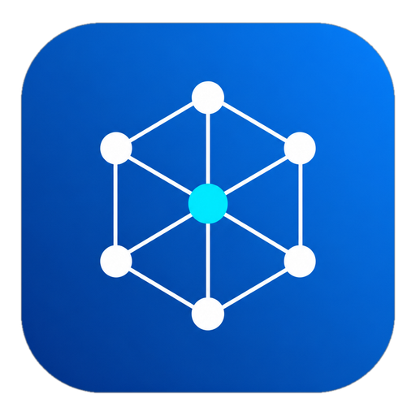
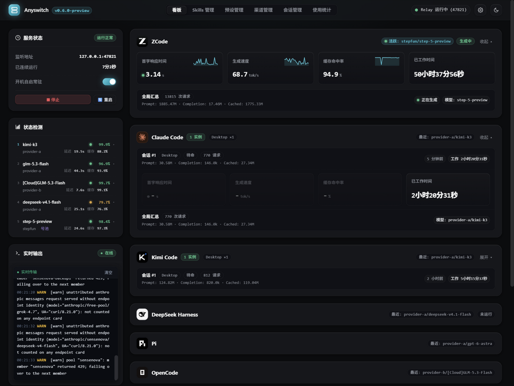
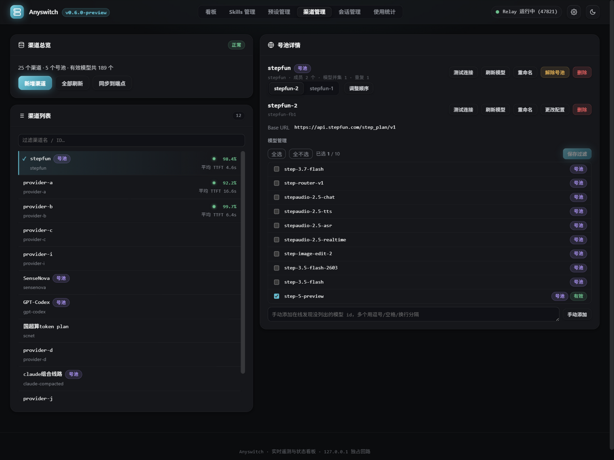
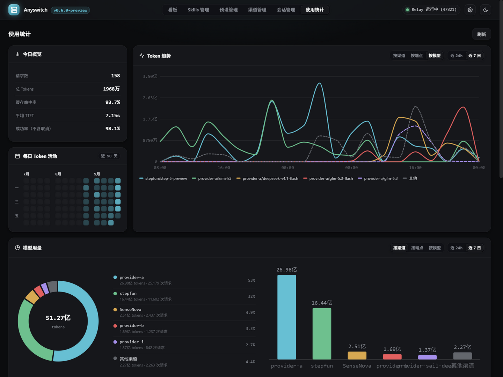
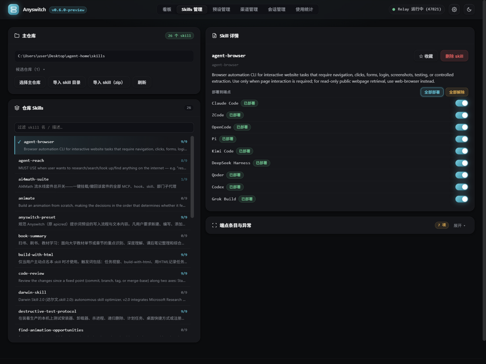
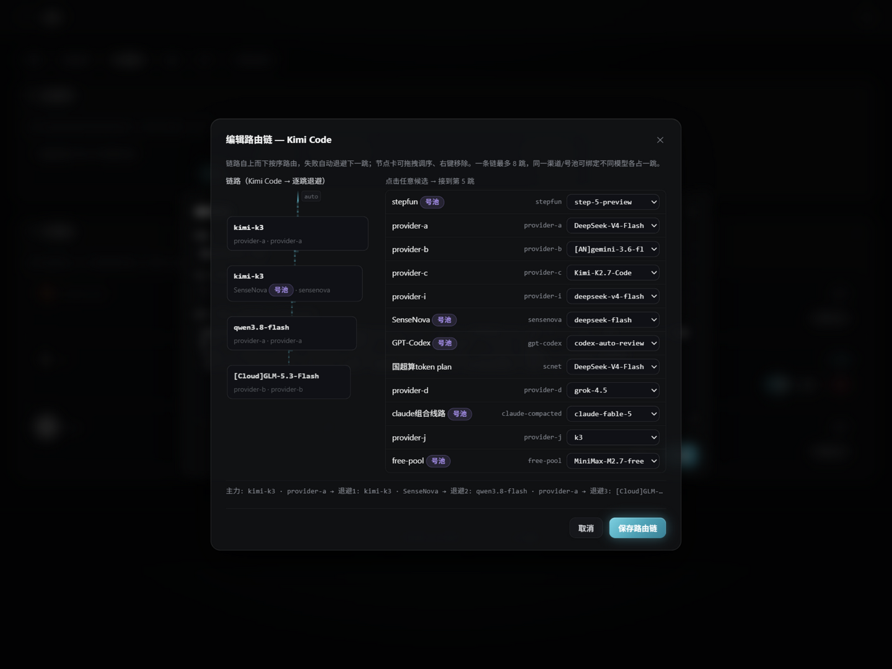

<sub>🌐 <b>中文</b> · <a href="#english">English</a></sub>

<div align="center">

<p></p>

# Anyswitch

> *「渠道配一次，九个 agent 一起用。」*
> *"Set up a channel once. Nine agents share it."*

[](LICENSE)
[](https://github.com/Aurora0134/Anyswitch/tree/v0.6.0-preview)
[](#这些边界要先接受)
[](package.json)

**一个跑在你自己机器上的 relay 和控制面板：多家模型渠道在一处配，九个 coding agent 从一处接。**

<sub>Windows 本地运行 · 凭据用 DPAPI 封存 · relay 只听环回地址 · 当前版本 0.6.0 preview</sub>

给第一个 agent 配渠道，谁都乐意：填 baseURL、填 key、勾模型，五分钟的事。到第四个 agent，你在把同样几十条配置往第四份配置文件里抄——而且每一份里的 API Key 都是明文，躺在每个 agent 进程都读得到的目录里。

这个工具存在的全部理由，是让「只配一次」和「只存一份密文」同时成立。

```bat
git clone --branch v0.6.0-preview --single-branch https://github.com/Aurora0134/Anyswitch.git "%LOCALAPPDATA%\Anyswitch\app"
```

源码发行，没有安装器。先看画面，再决定装不装。

[看效果](#效果渠道配一次九处都见它) · [安装](#装上就能用) · [路由](#挂了一个渠道流水线不该停) · [机制](#机制不是转发器是本机的配置真相源) · [边界](#这些边界要先接受)

</div>

---

## 效果：渠道配一次，九处都见它

面板在 `http://127.0.0.1:47820/panel`，relay 在 `127.0.0.1:47821`。面板管配置，relay 转请求——两个进程互不惊扰：relay 停了，面板照样打开给你看状态。

<p align="center">
  
  
  
  
</p>

一条请求走的路：

```text
Claude Code / Codex / 其他 agent
              │
              ▼
      127.0.0.1:47821 relay
       鉴权 · 路由 · 协议转换
              │
              ▼
       你配置的 OpenAI 兼容上游
```

面板里直接看得到的：看板（relay 状态、路由链实况、近期请求、agent 实例）、渠道管理（渠道、模型发现、号池、路由链）、虚拟模型、Skills 主仓库与各 agent 部署、用量统计（今日概览、90 天热力图、TTFT、TPS）、设置与客户端更新。

截图在 [`docs/screenshots/`](docs/screenshots/)，克隆后可直接打开核对页面形态。

---

## 装上就能用

### 先准备这三件事

- Windows。凭据封存走 Windows DPAPI，开机自启走计划任务。
- Node.js。`package.json` 要求 `>=22.15.0 <23 || >=23.8.0`，推荐 24 LTS。
- 一个新的安装目录。不要把预览版覆盖到正在运行的目录上。

### 第一次安装

```bat
git clone --branch v0.6.0-preview --single-branch https://github.com/Aurora0134/Anyswitch.git "%LOCALAPPDATA%\Anyswitch\app"
cd /d "%LOCALAPPDATA%\Anyswitch\app"
npm install
wscript panel-app.vbs
```

`npm install` 只为虚拟终端装依赖；不装它，relay、面板、渠道管理、启动器、统计照常用，只是终端页打不开。

手动启动面板也行：`node panel-launcher.mjs`。`panel-app.vbs` 按自身位置找启动器，安装目录不必固定，桌面快捷方式直接指它。

### 四步跑通第一条请求

1. 打开 `http://127.0.0.1:47820/panel`，进渠道管理。
2. 新增渠道：填渠道 ID、上游 Base URL、API Key。保存时 key 用当前 Windows 用户的 DPAPI 封存。
3. 等模型自动发现；上游没有 `GET /v1/models` 就手动补模型 ID。要容灾，再填备用地址。
4. 用对应 agent 的启动器拉起客户端——relay 地址、鉴权和实例身份由启动器交给它，其余参数原样透传。

装完自检：

```bat
node --version
node --check panel-host.mjs
npm test
```

---

## 九个 agent，一种接法

| agent | 协议面 | 启动方式 |
| --- | --- | --- |
| Claude Code | Anthropic Messages | `node launcher.mjs [claude 参数]` |
| Kimi Code | Anthropic Messages | `node kimi-launcher.mjs [kimi 参数]` |
| Codex CLI | OpenAI Responses | `node codex-launcher.mjs [codex 参数]` |
| OpenCode | OpenAI | `node opencode-launcher.mjs [opencode 参数]` |
| Pi | OpenAI | `node pi-launcher.mjs [pi 参数]` |
| ZCode | OpenAI | `node zcode-launcher.mjs [zcode 参数]` |
| DeepSeek Harness | OpenAI | `node dsh-launcher.mjs [dsh 参数]` |
| Qoder | OpenAI | `node qoder-launcher.mjs [qoder 参数]` |
| Grok Build | OpenAI | `node grok-launcher.mjs [grok 参数]` |

配置同步把托管渠道写进各 agent 自己的配置位置，你手写的其它内容原样保留：

| agent | Anyswitch 写入的位置 |
| --- | --- |
| Kimi Code | `~/.kimi-code/config.toml` |
| Codex | `~/.codex/config.toml` 与生成的模型目录 |
| OpenCode | `~/.config/opencode/opencode.json`（你的 `opencode.jsonc` 不动） |
| Pi | `~/.pi/agent/models.json` |
| ZCode | `~/.zcode/v2/config.json` |
| DeepSeek Harness | `~/.dsh/profiles/<name>/cordis.patch.yml` |
| Qoder | `~/.qoder/settings.json` |
| Grok Build | `~/.grok/config.toml` |

写进这些文件的是本地 relay 地址和一枚本地 token——上游的真实 key 不进任何 agent 的配置目录。Claude Code 走启动器注入，另可在设置页配置档位接管。直接在终端里启动客户端也支持：relay 会按连接属主进程把流量归到正确的实例上。

---

## 挂了一个渠道，流水线不该停

面板里管流量走向的有三样东西：号池、路由链、备用地址。它们各管一层，可以叠着用。

### 号池：一个渠道挂了，先试另一个

把 2–5 个渠道收进一个号池。请求命中号池后在成员间保持粘性——同一段会话不会每句话换一个渠道；当前成员失败，按顺序退到下一个。agent 看到的是号池这一个入口，不是一堆散渠道。

### 路由链：模型名不绑死渠道

每个 agent 可以有自己的 `auto` 链：发 `auto` 的请求按链顺序逐跳尝试。链上的节点可以是渠道，也可以是号池——两层容灾叠着用。

```text
模型名
  └─ 节点 A：主渠道
       └─ 节点 B：号池
            └─ 节点 C：备用渠道
```

节点失败逐跳退避；连续失败的节点暂时锁定，等锁定期过了由真实请求驱动回到链首重试。删渠道、解散号池时，引用它的链条目在同一笔写入里被剪掉，不留悬空节点。链的每一跳在看板上有实况灯：哪跳在走、哪跳降级，直接看得到。

<p align="center">
  
</p>

### 虚拟模型：一个名字，九个 agent 都认

虚拟模型是你自建的名字，绑一条不专属任何 agent 的链（1–8 个节点）。启用后，它和 `auto` 一起出现在全部九个 agent 模型列表的 Anyswitch 分组里；停用即从所有目录消失。

它解决的是「同一个角色，到处叫同一个名字」：把 `deepseek-pro` 定义成「主渠道 → 备用池」，之后 Claude Code 里选它、Codex 里选它，走的是同一条链。链状态还是跨 agent 共享的——一个 agent 把某节点打降级了，另一个 agent 的请求直接绕开它，不重复交学费。

命名规则：小写字母开头，可含数字和 `. _ -`，最长 64 字符，不能与链内模型重名；名字保存后锁定，之后改的只是链。

### 备用地址：服务商有多个入口

渠道自己还有最后一道保险：`baseURL` 加多个 `fallbackURLs`。每个地址 180 秒生成预算，重试间隔指数退避（1 秒起、4 秒封顶）；4xx 是请求终态，不再换地址；5xx 才换下一个。全部地址耗尽时，透传最后一个真实上游 5xx；纯传输失败返回 502。

---

## 0.6.0 preview 修好的那些「明明配好了」

**DeepSeek Harness 0.2：90 个会话文件曾整个消失。** 0.2 把会话文件改成代际命名，旧适配器只认 `session.jsonl.zstd`——实测一台升级后的机器：218 个会话文件里 71 个 v4 和 19 个 v3 在列表里整条不出现，零报错，TUI 和 Web 同样中招。本版读同目录代际最高的规范文件，删除时清掉全部代际；列表从 127 条回到 198 条。官方桌面端不经过启动器，面板现在按桌面宿主标志认出它，桌面形态与 TUI、Web 在同一个 DeepSeek Harness 下统计。

**Claude Code：档位、发现、上下文窗口终于分开。** 设置页给 Sonnet / Opus / Fable / Haiku 各自指定托管模型，总开关可暂停接管而保留选择；CLI 只在已验证的版本族里打开模型发现；目录每行带上下文窗口，百万级窗口另出 `[1m]` 伴生行。Claude 桌面端的菜单品牌过滤是它自己编译进去的——实测三态：现状 28 条、给目录补字段仍 28 条、换确定性别名后 148 条全过滤链通过。本版用别名视图把全量送回菜单；客户端那道黑名单本身，谁也替它拆不了。

**客户端更新不再绑死面板。** 「全部更新」并行派发不同客户端；安装跑在独立进程里，关掉面板不杀任务，重开关于页能接回结果；Claude 桌面端走官方 MSIX 并校验签名。

**会话目录只数你真正说过的话。** 旧版按消息角色数轮次——实测一条 1231 条记录的会话里，1216 条是工具结果在冒充用户输入；抽样 25 条会话共数出 5072 条同类噪声。本版把轮次判定收进数据层，目录中位数从 134 回到 4。

**两个「点不动」的故障收口。** 安装目录带低完整性标记时，Windows 曾把凭据解密脚本当 Internet 区脚本硬拒——所有渠道探测失败、上游请求 502，本版按进程级执行策略调用。导出配置包曾借浏览器窗口做原生选择框的属主，被 shell 拒绝、框根本不画出来，本版改无属主显示。

---

## 终端页：刷新不再洗掉屏幕

面板里内置虚拟终端，能直接拉起本机已装好的 8 个 CLI agent（ZCode 与 Codex 桌面端是图形程序，不在此列）。凭据只走会话环境变量，不写进任何终端配置文件。

这一版的核心修复是回放。实测同一条真实会话：旧路径回放 470,208 字节，换来 **0 行**可回滚历史；新的「宿主渲染镜像、按行重发」用 65,131 字节换回 **1583 行**。整页刷新后，你仍停在终端页，仍停在原来的页签。

中文输入法组字、Ctrl+C 复制、OpenCode 的 Ctrl+Enter 换行、块字符与 WebGL 渲染，都在这一版收口。

它还是预览功能：要多装一次 npm 依赖，panel-host 重启会结束当时的终端进程——历史画面保留，会话标记为已退出。

---

## 机制：不是转发器，是本机的配置真相源

```text
%LOCALAPPDATA%\Anyswitch\
├── store.json       渠道、模型、号池、路由链、虚拟模型的元数据
├── credentials\     每个渠道一个 DPAPI 密文文件
├── settings.json    面板与各 agent 开关
├── usage\           按日记录的请求与会话用量
└── app\             本仓库：relay、面板、启动器
```

- **`store.json` 不放秘密。** schema 内置词表（apikey、token、secret、password……）逐段匹配字段名，命中即拒绝写入；key 只以 `credentialFile` 引用的形式连到凭据目录。复算：`grep -n "SECRET_WORDS" store-schema.mjs`。
- **relay 只听环回。** 面板 `127.0.0.1:47820`、relay `127.0.0.1:47821`、watchdog 标记 `47822`；环回地址强制进 `NO_PROXY`，本地请求不会被继承的代理带走。
- **key 只在请求那一刻解密。** DPAPI 用当前用户作用域；明文不写 store、不进日志、不长期缓存。
- **写入有并发保护。** 面板写 store 走内容哈希 CAS 加文件锁；路由目录带 generation 摘要，配置在请求中途变化时拒绝用旧目录。
- **业务代码零 npm 依赖。** 全部 5 个依赖都属于虚拟终端，`.mjs` 里 import 第三方包的只有一处。复算：`grep -n 'from "node-pty"\|from "@xterm' *.mjs` ——只有 `terminal-host.mjs:13`。

上游请求当然会离开本机，去往你在渠道里填的服务商地址。Anyswitch 守的是凭据存储、路由配置和本地控制面——不会把上游调用伪装成离线运行。

---

## 和 CC Switch 的关系：它改文件，我过流量

| | **Anyswitch** | [CC Switch](https://github.com/farion1231/cc-switch) |
| --- | --- | --- |
| 定位 | 转发控制台 | 配置切换器 |
| 动作对象 | 请求流量：relay 转发、协议转换、退避重试 | 配置文件：往各 CLI 的配置里写供应商 |
| 核心资产 | 转发链、号池、凭据不出本机、用量观测 | 供应商数据库、live 配置双向同步 |
| 形态 | 常驻 relay + Web 面板 | Tauri 桌面应用 |

两句公道话：CC Switch 成熟、管理面广，供应商预设库和双向同步是它的强项；Anyswitch 强在转发质量与凭据边界，代价是你得自己跑一个本地服务。对比基于 cc-switch v3.20.3 的只读调研，核查日期 2026-09-17。

---

## 提示词预设，也不要手改配置

附带可选技能 [`skills/anyswitch-preset/`](skills/anyswitch-preset/SKILL.md)：让 coding agent 帮你编写和管理面板里的提示词预设。预设由面板写进各 agent 自己的全局指令文件——多数是 `AGENTS.md`，Claude Code 是 `CLAUDE.md`。

```bat
xcopy skills\anyswitch-preset "%USERPROFILE%\.kimi-code\skills\anyswitch-preset" /E /I
```

写入走面板 API（`http://127.0.0.1:47820`），不要手改 `prompts.json`。注意：写入的是你家目录里属于其他 agent 的文件，启用前先确认这一点。

---

## 接下来要去哪

规划中的下一步：**把 agent 本地已经堆好的配置收编进中控。** 检测各 agent 配置目录里现存的渠道与模型，拉取进 Anyswitch 统一管理——哪怕你已经在某一个 agent 里攒了几十条配置，也能一次转移；之后配其他 agent 时直接扩散，不用再抄一遍。

这条还没实现。写出来是让你知道方向，也是让它可以被催——想要的，去 issue 里说一声。

---

## 这些边界要先接受

- **只支持 Windows，不支持 macOS / Linux。** DPAPI、计划任务、原生客户端检测、部分更新路径都依赖 Windows，没有其它平台的实现。
- **没有安装器，也没有自更新。** 0.6.0 preview 以源码发行；升级就是换个 tag、再重启进程。
- **端口是固定的。** 47820 / 47821 / 47822 写死在代码里，面板里改不了。
- **虚拟终端还是预览。** 它要单独装依赖，panel-host 重启会带走当时的终端进程。
- **有三条真实路径只验到代码与测试层。** 8 个 CLI 的面板内启动、虚拟模型在九个客户端选择器里的逐一显示、关于页的真实安装按钮——都对着真实文件与官方发布格式核过，但没有替你在每台客户端上按完一遍。
- **Claude 桌面端的菜单过滤是客户端自己的。** 我们能给发现目录、别名视图和严格路由，不能替它拆掉编译进去的品牌黑名单。

这是一个 0.6.0 的预览版，不是 1.0 的成品。对「渠道散落在九个配置文件里」的人来说，预览版已经够用；要拿它上生产流水线的，等正式版。

---

## 升级时，保留数据和 `.git`

从 `v0.5.2` 升到 `v0.6.0-preview`，用户数据仍在 `%LOCALAPPDATA%\Anyswitch\` 的 `app` 上层：渠道、凭据、设置、预设和用量记录不随源码目录一起替换。

先安排现有会话的空档，再检查安装目录的工作树：

```bat
cd /d "%LOCALAPPDATA%\Anyswitch\app"
git status --short
```

有输出就先处理自己的改动，别为了升级直接丢弃。工作树干净后，只取目标标签：

```bat
git fetch --no-tags origin tag v0.6.0-preview
git switch --detach v0.6.0-preview
npm install
```

不要把新源码整目录覆盖到旧安装，也不要用 `git reset --hard` 升级。保留 `.git` 以及它指向的外部 Git 对象库；升级前备份 `%LOCALAPPDATA%\Anyswitch\`。

源码换好后，要新的 panel-host 进程后端才生效——浏览器刷新只重读页面文件。面板里的**重启**会先重启 relay 再重启 panel-host，可能中断请求和终端会话，请在空档执行。

这是预览版：稳定版安装不会自动收到它，`v0.5.2` 正式版 Release 保持原样。

---

## 代码在哪，数据在哪

```text
Anyswitch/
├── panel-host.mjs              # 47820 面板宿主
├── relay-host.mjs              # 47821 常驻 relay 宿主
├── panel.mjs                   # 面板 API 与静态页面路由
├── panel-ui/                   # 面板页面、样式和脚本
├── launch.mjs                  # relay 生产装配与请求转发
├── launcher.mjs                # Claude Code 启动器
├── *-launcher.mjs              # 其他八个 agent 的启动器
├── agent-sync.mjs              # 托管渠道同步到各 agent 配置
├── agent-metrics.mjs           # 进程、请求、实例和看板读数
├── session-scan.mjs            # 各 agent 的会话读取与适配
├── agent-skills.mjs            # Skills 主仓库与部署
├── skills/anyswitch-preset/    # 可选的预设管理技能
├── docs/                       # 架构文档与真实截图
├── package.json                # 版本、Node 范围、虚拟终端依赖
├── SECURITY.md                 # 漏洞报告与安全模型
└── LICENSE                     # Apache-2.0
```

想核对本版的实际提交范围：

```bat
git log --no-merges --oneline v0.5.2..v0.6.0-preview
```

---

## 反馈与贡献

- **Bug**：写清 Windows 版本、Node 版本、客户端形态、复现步骤和实际错误；不要附 API Key、凭据文件或完整会话内容。
- **功能提案**：先说你的工作流在哪一步停住，再说期望的结果；实现方案留在讨论里。
- **代码修改**：遵循 [`CONTRIBUTING.md`](CONTRIBUTING.md)——Node.js ESM、内置 `node:test`、规格与代码同笔更新。
- **安全问题**：走 [`SECURITY.md`](SECURITY.md) 指向的 GitHub Security Advisories，不要公开发可利用细节。

## 致谢与灵感来源

- 提示词预设管理的功能灵感来自 [RP-Hub](https://github.com/STA1N156/RP-Hub)。
- 使用统计页的设计，部分参考了 ZCode。
- 部分功能借鉴自 [CC Switch](https://github.com/farion1231/cc-switch)——它与 Anyswitch 的定位差异见[上文的对比节](#和-cc-switch-的关系它改文件我过流量)。
- 虚拟模型与自动路由的设计借鉴了 [autoAPI](https://github.com/happy66dev/AutoAPI)。

## License

[Apache-2.0](LICENSE)——可以用，可以改，可以分发，保留协议与版权声明。第三方产品名称和商标归各自所有者，见 [`NOTICE`](NOTICE)。

---

<div align="center">

**Anyswitch** 管渠道、管路由、管凭据。<br>
**你**，只需要配一次。<br>
*渠道配一次，九个 agent 一起用。*

</div>

---

## English

A Windows-local relay and control panel: you configure model providers once, and nine coding agents connect through the same place.

> *"Set up a channel once. Nine agents share it."*

Setting up a provider for your first agent is fun: base URL, API key, pick models — five minutes. By the fourth agent, you are copying the same dozens of entries into a fourth config file — and every copy of your API key sits there in plaintext, in a directory each agent process can read.

This tool exists to make "configure once" and "store exactly one sealed copy" true at the same time.

```bat
git clone --branch v0.6.0-preview --single-branch https://github.com/Aurora0134/Anyswitch.git "%LOCALAPPDATA%\Anyswitch\app"
```

Source-distributed, no installer. Supported agents: Claude Code, Kimi Code, Codex, OpenCode, Pi, ZCode, DeepSeek Harness, Qoder, Grok Build.

### What you see is what runs

The panel lives at `http://127.0.0.1:47820/panel`, the relay at `127.0.0.1:47821`. The panel manages configuration; the relay forwards requests. They are separate processes — if the relay stops, the panel still opens and shows you the state.

<p align="center">
  
  
  
  
</p>

- **Board**: relay status, live route chains, recent requests, agent instances.
- **Channels**: providers, model discovery, pools, route chains.
- **Virtual models**: named, agent-agnostic route chains published to all nine agents.
- **Skills**: one master repository, deployed to or adopted from each agent, with line-by-line diffs.
- **Statistics**: today at a glance, a 90-day heatmap, TTFT, TPS, per-agent usage.
- **Settings & About**: themes, Claude Code tier mapping, thinking-effort injection, environment detection, client updates.

Real screenshots live in [`docs/screenshots/`](docs/screenshots/) — clone and open them directly to verify the pages.

### Install

You need: Windows (credentials are sealed with Windows DPAPI; autostart uses Task Scheduler), Node.js `>=22.15.0 <23 || >=23.8.0` (24 LTS recommended), and a fresh install directory — do not unpack the preview over a running installation.

```bat
git clone --branch v0.6.0-preview --single-branch https://github.com/Aurora0134/Anyswitch.git "%LOCALAPPDATA%\Anyswitch\app"
cd /d "%LOCALAPPDATA%\Anyswitch\app"
npm install
wscript panel-app.vbs
```

`npm install` only prepares the virtual terminal's dependencies. Without it, the relay, panel, channel management, launchers and statistics all work; only the terminal page stays closed.

Four steps to your first request:

1. Open `http://127.0.0.1:47820/panel` and go to channel management.
2. Add a provider: ID, upstream base URL, API key. The key is sealed with the current Windows user's DPAPI on save.
3. Wait for model discovery; if the upstream has no `GET /v1/models`, enter model IDs manually. Add fallback URLs for failover.
4. Launch your client through its launcher — it hands over the relay address, credentials and instance identity; every other argument passes through untouched.

### Nine agents, one way in

| Agent | Protocol | Launch |
| --- | --- | --- |
| Claude Code | Anthropic Messages | `node launcher.mjs [claude args]` |
| Kimi Code | Anthropic Messages | `node kimi-launcher.mjs [kimi args]` |
| Codex CLI | OpenAI Responses | `node codex-launcher.mjs [codex args]` |
| OpenCode | OpenAI | `node opencode-launcher.mjs [opencode args]` |
| Pi | OpenAI | `node pi-launcher.mjs [pi args]` |
| ZCode | OpenAI | `node zcode-launcher.mjs [zcode args]` |
| DeepSeek Harness | OpenAI | `node dsh-launcher.mjs [dsh args]` |
| Qoder | OpenAI | `node qoder-launcher.mjs [qoder args]` |
| Grok Build | OpenAI | `node grok-launcher.mjs [grok args]` |

Config sync writes managed channels into each agent's own config location and leaves everything you wrote by hand untouched:

| Agent | Where Anyswitch writes |
| --- | --- |
| Kimi Code | `~/.kimi-code/config.toml` |
| Codex | `~/.codex/config.toml` plus a generated model catalog |
| OpenCode | `~/.config/opencode/opencode.json` (your `opencode.jsonc` is never touched) |
| Pi | `~/.pi/agent/models.json` |
| ZCode | `~/.zcode/v2/config.json` |
| DeepSeek Harness | `~/.dsh/profiles/<name>/cordis.patch.yml` |
| Qoder | `~/.qoder/settings.json` |
| Grok Build | `~/.grok/config.toml` |

These files receive a loopback relay address and a local token — your real upstream keys never enter any agent's config directory. Claude Code is wired through its launcher instead, with optional tier mapping in Settings. Starting clients directly from a terminal also works: the relay attributes traffic to the right instance by owning process.

### A dead channel should not stop the pipeline

Three things in the panel steer your traffic: pools, route chains and fallback URLs. Each covers one layer, and they stack.

#### Pools: one provider down, try another

Group 2–5 providers into a pool. Requests stick to a member — one conversation does not hop providers mid-way — and a failing member fails over in order. Agents see one pool entry, not a pile of loose providers.

#### Route chains: a model name is not married to one provider

Each agent can have its own `auto` chain: requests sent as `auto` try the chain hop by hop. A chain node can be a provider or a pool — two layers of failover, stacked.

```text
model name
  └─ node A: primary provider
       └─ node B: pool
            └─ node C: fallback provider
```

Failing nodes degrade hop by hop; repeatedly failing nodes are latched aside until their window expires, then real requests re-anchor the chain at the head. Deleting a provider or dissolving a pool prunes every chain reference in the same write — no dangling nodes. Every hop shows a live lamp on the board: which hop is carrying traffic, which one is degraded.

<p align="center">
  
</p>

#### Virtual models: one name, recognized by all nine agents

A virtual model is your own name bound to a chain that belongs to no single agent (1–8 nodes). While enabled, it appears together with `auto` in the Anyswitch group of all nine agents' model lists; disable it and it disappears from every catalog.

It answers "the same role should have the same name everywhere": define `deepseek-pro` as "primary provider → backup pool", then pick it in Claude Code or in Codex — the same chain carries the request. Chain state is shared across agents too: if one agent gets a node latched as degraded, another agent's requests skip it directly instead of paying the same tuition.

Naming: starts with a lowercase letter, may contain digits and `. _ -`, at most 64 characters, and cannot collide with a model inside its own chain. The name locks on save — afterwards you edit the chain, not the name.

#### Fallback URLs: the vendor has more than one entrance

The last safety net sits on the provider itself: a `baseURL` plus several `fallbackURLs`. Each address gets a 180-second generation budget, and retries back off exponentially (1s up to a 4s cap); 4xx is terminal and stays put, 5xx moves to the next address. When every address is exhausted, the last real upstream 5xx passes through; pure transport failures return 502.

### What 0.6.0 preview fixed

**DeepSeek Harness 0.2: 90 session files had vanished.** 0.2 renamed session files by generation, and the old adapter only recognized `session.jsonl.zstd` — on a real upgraded machine, 71 v4 and 19 v3 files out of 218 were entirely absent from the list, with zero errors, hitting TUI and Web alike. This release reads the highest canonical generation per directory and clears all generations on delete; the session list went from 127 back to 198 entries. The official desktop app bypasses the launcher entirely, so the panel now recognizes it by its desktop-host signature and counts Desktop alongside TUI and Web under one DeepSeek Harness entry.

**Claude Code: tiers, discovery and context windows finally separated.** Settings map Sonnet / Opus / Fable / Haiku to managed models, with a master switch that pauses mapping while keeping your choices; the CLI only opens model discovery on verified version families; every catalog row carries its context window, and million-token windows get a `[1m]` companion row. Claude Desktop's menu brand filter is compiled into the client — measured three ways: 28 entries as-is, still 28 with extra catalog fields, and all 148 passing the full filter chain once given deterministic aliases. This release ships that alias view; the blacklist itself belongs to the client, and nobody can remove it for them.

**Client updates no longer die with the panel.** "Update all" dispatches different clients in parallel; installs run in a detached process, so closing the panel does not kill them, and reopening the About page reattaches to the result; Claude Desktop updates go through the official MSIX with signature verification.

**Session catalogs only count what you actually said.** The old version counted turns by message role — in one measured session, 1216 of 1231 "user" records were tool outputs; a 25-session sample contained 5072 such noise records. Turn detection now lives in the data layer, and the median catalog length dropped from 134 to 4.

**Two "nothing happens when I click" bugs closed.** When the install directory carried a low-integrity label, Windows rejected the credential-decryption script as an Internet-zone script — every channel probe failed and upstream requests returned 502; the script now runs with a process-level execution policy. The config-export dialog used to borrow the browser window as its owner and got refused by the shell, so no dialog ever appeared; it now shows ownerless.

### The terminal page: refresh no longer wipes your screen

The panel embeds a virtual terminal that can launch the 8 installed CLI agents directly (ZCode and Codex Desktop are graphical apps and stay out). Credentials travel only through session environment variables — nothing is written into terminal config files.

The core fix this release is replay. Measured on the same real session: the old path replayed 470,208 bytes into **0 lines** of scrollback; the new "host-side rendered mirror, replayed line by line" turns 65,131 bytes into **1583 lines**. After a full page refresh you are still on the terminal page, still on the same tab.

IME composition for Chinese input, Ctrl+C copy, OpenCode's Ctrl+Enter newline, block glyphs and WebGL rendering all landed in this release.

It is still a preview feature: it needs one extra `npm install`, and restarting panel-host ends the PTYs running at that moment — their screens are kept, marked as exited.

### Not a forwarder — the local source of truth for configuration

```text
%LOCALAPPDATA%\Anyswitch\
├── store.json       provider, model, pool, route-chain and virtual-model metadata
├── credentials\     one DPAPI-sealed file per provider
├── settings.json    panel and per-agent switches
├── usage\           daily request and session usage
└── app\             this repository: relay, panel, launchers
```

- **No secrets in `store.json`.** The schema carries a word list (apikey, token, secret, password…), matches field names segment by segment, and refuses the write on a hit; keys connect to the credentials directory only through `credentialFile` references. Verify: `grep -n "SECRET_WORDS" store-schema.mjs`.
- **Loopback only.** Panel `127.0.0.1:47820`, relay `127.0.0.1:47821`, watchdog marker `47822`; loopback addresses are forced into `NO_PROXY` so inherited proxies cannot carry local requests away.
- **Keys are decrypted only at request time.** DPAPI runs at current-user scope; plaintext never enters the store, the logs, or any long-lived cache.
- **Writes are concurrency-guarded.** Panel writes go through content-hash CAS with a file lock; routing catalogs carry a generation digest, and a configuration that changes mid-request refuses to serve the stale one.
- **Zero npm dependencies in the business code.** All 5 dependencies belong to the virtual terminal; exactly one `.mjs` file imports a third-party package. Verify: `grep -n 'from "node-pty"\|from "@xterm' *.mjs` — only `terminal-host.mjs:13`.

Upstream requests obviously leave the machine, toward the provider addresses you configured. Anyswitch guards credential storage, routing configuration and the local control plane — it does not pretend upstream calls are offline.

### Relationship to CC Switch: it edits files, we carry traffic

| | **Anyswitch** | [CC Switch](https://github.com/farion1231/cc-switch) |
| --- | --- | --- |
| Positioning | Forwarding console | Configuration switcher |
| Acts on | Request traffic: relay, protocol translation, backoff and retry | Config files: writes providers into each CLI's configuration |
| Core assets | Route chains, pools, keys never leave the machine, usage telemetry | Provider database, two-way live-config sync |
| Form | Resident relay + web panel | Tauri desktop app |

To be fair: CC Switch is mature and broad, and its provider preset library with two-way sync is genuinely strong; Anyswitch wins on forwarding quality and credential boundaries, at the cost of running a local service yourself. Comparison based on a read-only review of cc-switch v3.20.3, checked 2026-09-17.

### Prompt presets: don't hand-edit those files either

Ships with an optional skill, [`skills/anyswitch-preset/`](skills/anyswitch-preset/SKILL.md), that lets a coding agent author and manage the panel's prompt presets. The panel writes active presets into each agent's own global instruction file — `AGENTS.md` for most, `CLAUDE.md` for Claude Code.

```bat
xcopy skills\anyswitch-preset "%USERPROFILE%\.kimi-code\skills\anyswitch-preset" /E /I
```

Writes go through the panel API (`http://127.0.0.1:47820`); do not hand-edit `prompts.json`. Note that these writes land in other agents' files under your home directory — confirm that before enabling.

### Where this is going

The planned next step: **pulling configurations that already exist in agents' local directories into the central store.** Detect the providers and models already sitting in each agent's config directory and import them into Anyswitch — so even if you have accumulated dozens of entries in one agent over months, you migrate once, and every other agent picks them up without another round of copying.

This is not implemented yet. It is written here so you know the direction — and so you can push it forward: ask for it in an issue.

### Accept these boundaries first

- **Windows only; no macOS / Linux support.** DPAPI, Task Scheduler, native client detection and parts of the update path all depend on Windows, and no other platform implementation exists.
- **No installer, no self-update.** 0.6.0 preview ships as source; upgrading means fetching a tag and restarting processes.
- **Ports are fixed.** 47820 / 47821 / 47822 are constants in the code and cannot be changed from the panel.
- **The virtual terminal is still preview.** It needs its own dependencies, and a panel-host restart takes the running PTYs with it.
- **Three real paths are verified only to code and test level.** Panel-launched sessions for the 8 CLIs, virtual models appearing in all nine clients' pickers, and the real install buttons on the About page — each checked against real files and official release formats, but not clicked through on every client for you.
- **Claude Desktop's menu filter belongs to the client.** We provide discovery catalogs, the alias view and strict routing; the brand blacklist compiled into their app is not ours to remove.

This is a 0.6.0 preview, not a 1.0 product. If your pain is "channels scattered across nine config files", the preview is already enough. If you want it on a production pipeline, wait for the stable release.

### Upgrading: keep your data and `.git`

From `v0.5.2` to `v0.6.0-preview`, user data stays above `app` in `%LOCALAPPDATA%\Anyswitch\`: providers, credentials, settings, presets and usage records are not replaced with the source directory.

Park your running sessions, then check the working tree:

```bat
cd /d "%LOCALAPPDATA%\Anyswitch\app"
git status --short
```

If it prints anything, deal with your own changes first — do not discard them for an upgrade. With a clean tree, fetch only the target tag:

```bat
git fetch --no-tags origin tag v0.6.0-preview
git switch --detach v0.6.0-preview
npm install
```

Do not unpack new source over an old install, and do not upgrade with `git reset --hard`. Keep `.git` and the external object database it points to; back up `%LOCALAPPDATA%\Anyswitch\` first.

New source needs a new panel-host process for the backend to take effect — a browser refresh only re-reads page files. The panel's **Restart** restarts the relay and then panel-host, and may interrupt requests and terminal sessions; run it between sessions.

This is a preview: stable installations will not receive it automatically, and the `v0.5.2` Release stays as it is.

### Where the code lives

```text
Anyswitch/
├── panel-host.mjs              # panel host on 47820
├── relay-host.mjs              # resident relay host on 47821
├── panel.mjs                   # panel API and static routes
├── panel-ui/                   # panel pages, styles and scripts
├── launch.mjs                  # relay assembly and request forwarding
├── launcher.mjs                # Claude Code launcher
├── *-launcher.mjs              # launchers for the other eight agents
├── agent-sync.mjs              # syncs managed channels into agent configs
├── agent-metrics.mjs           # processes, requests, instances and board readings
├── session-scan.mjs            # session readers and adapters per agent
├── agent-skills.mjs            # skills master repository and deployment
├── skills/anyswitch-preset/    # optional preset-management skill
├── docs/                       # architecture docs and real screenshots
├── package.json                # version, Node range, terminal dependencies
├── SECURITY.md                 # vulnerability reports and security model
└── LICENSE                     # Apache-2.0
```

To audit what actually changed in this release:

```bat
git log --no-merges --oneline v0.5.2..v0.6.0-preview
```

### Feedback and contributing

- **Bugs**: include Windows version, Node version, client flavor, reproduction steps and the actual error; never attach API keys, credential files or full session contents.
- **Feature proposals**: say where your workflow stops today, then the outcome you want; leave implementation to the discussion.
- **Code**: follow [`CONTRIBUTING.md`](CONTRIBUTING.md) — Node.js ESM, built-in `node:test`, specs updated in the same commit as the code.
- **Security**: use the GitHub Security Advisories route in [`SECURITY.md`](SECURITY.md); do not publish exploitable details.

### Acknowledgements

- The prompt-preset feature was inspired by [RP-Hub](https://github.com/STA1N156/RP-Hub).
- The statistics page is partly designed after ZCode.
- Some features borrow from [CC Switch](https://github.com/farion1231/cc-switch) — see the comparison section above for how the two differ.
- Virtual models and auto-routing borrow from [autoAPI](https://github.com/happy66dev/AutoAPI).

## License

[Apache-2.0](LICENSE) — use it, change it, redistribute it; keep the license and copyright notices. Third-party product names and trademarks belong to their owners; see [`NOTICE`](NOTICE).
